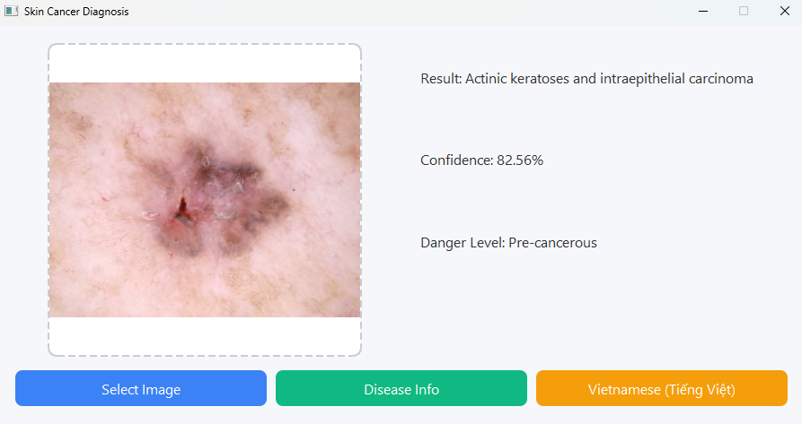

# Skin Cancer Diagnosis with Vision Transformer

## Introduction

This project applies the **Vision Transformer (ViT)** model to classify skin lesions using the **HAM10000** dataset. The goal is to develop a deep learning model that can assist in the early diagnosis of skin cancer by accurately identifying different types of skin lesions from dermoscopic images.

ViT models have shown strong performance in image classification tasks by leveraging transformer architectures — originally used for natural language processing — to process image patches. This project demonstrates how ViTs can be fine-tuned for medical image classification.

---

## Dataset

**Skin Cancer MNIST: HAM10000**  
This dataset contains 10,000+ dermatoscopic images of common pigmented skin lesions, classified into 7 categories:

- akiec (Actinic keratoses and intraepithelial carcinoma)
- bcc (Basal cell carcinoma)
- bkl (Benign keratosis-like lesions)
- df (Dermatofibroma)
- mel (Melanoma)
- nv (Melanocytic nevi)
- vasc (Vascular lesions)

 Dataset link:  
[Kaggle - HAM10000](https://www.kaggle.com/datasets/kmader/skin-cancer-mnist-ham10000)

---


## Approach

### 1. Preprocessing

- Images resized to **224x224**
- Mapped labels to integers (0–6)
- Visualized class distribution

### 2. Model

- Used **`google/vit-base-patch16-224-in21k`** from HuggingFace
- Loaded with `AutoModelForImageClassification`
- Modified classification head for 7 output classes

### 3. Training

- Optimizer: `AdamW`
- Loss: `CrossEntropyLoss`
- Metrics: Accuracy
- Training for multiple epochs with early stopping

### 4. Evaluation

- Evaluated on validation set
- Printed classification report
- Plotted confusion matrix

---


## Results

- The ViT model achieved strong performance on the validation set, especially in distinguishing common classes like `nv` and `mel`.
- Class imbalance remains a challenge (e.g., low support for `df` and `vasc`).
- Further data augmentation or oversampling can improve minority class performance.

---

## Get started 
### Clone the repository
```bash
git clone https://github.com/DinhXuanKhuong/Skin-Cancer-Diagnosis-with-Vision-Transformer.git
cd Skin-Cancer-Diagnosis-with-Vision-Transformer/
```
### Create virtual environment
#### MacOS/Linux
```bash
python3 -m venv env
source ./env/bin/activate
```

#### Window
```bash
python -m venv env
.\env\Scripts\activate
```

If it says 'cannot be loaded because running scripts is disabled on this system. For more information, see about_Execution_Policies at this [link](https://learn.microsoft.com/en-us/powershell/module/microsoft.powershell.core/about/about_execution_policies?view=powershell-7.5).

Run your PowerShell as Administrator

```bash
Set-ExecutionPolicy -ExecutionPolicy RemoteSigned
```

Then type "Y" and enter.
Then run the active command again

```bash
.\env\Scripts\activate
```

### Installed required dependencies
```bash
pip3 install -r requirements.txt
```
### How to run
```bash
python main_ui.py
```
### Example output

## References

- [Ahmed Metawea - Skin Cancer Detection with ViT (Kaggle Notebook)](https://www.kaggle.com/code/ahmed1metawea/skin-cancer-detection-with-vision-transformer/notebook)
- [Original HAM10000 Dataset Paper](https://dataverse.harvard.edu/dataset.xhtml?persistentId=doi:10.7910/DVN/DBW86T)